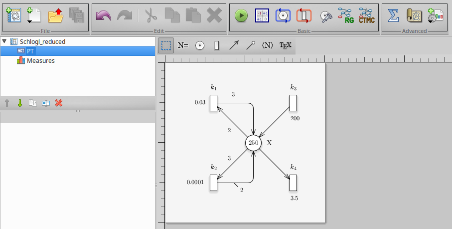

-   <a href="#introduction" id="toc-introduction">Introduction</a>
-   <a href="#how-to-start" id="toc-how-to-start">How to start</a>
    -   <a href="#something-to-know" id="toc-something-to-know">Something to
        know</a>
-   <a href="#cases-of-study" id="toc-cases-of-study">Cases of study</a>
    -   <a href="#the-schlogl-model" id="toc-the-schlogl-model">The Schlogl
        model</a>
    -   <a href="#model-generation" id="toc-model-generation">Model
        generation</a>
    -   <a href="#model-analysis" id="toc-model-analysis">Model Analysis</a>
    -   <a href="#deterministic-model"
        id="toc-deterministic-model">Deterministic model</a>
    -   <a href="#mass-action-law-considerations"
        id="toc-mass-action-law-considerations">Mass-action law
        considerations</a>
    -   <a href="#stochastic-model" id="toc-stochastic-model">Stochastic
        model</a>
    -   <a href="#sensitivity-analysis"
        id="toc-sensitivity-analysis">Sensitivity analysis</a>
    -   <a href="#calibration-analysis"
        id="toc-calibration-analysis">Calibration analysis</a>
-   <a href="#references" id="toc-references">References</a>

# Introduction

In this brief report, we describe an illustrative usage for the R
library *epimod*. In detail, *epimod* implements a new general modeling
framework to study epidemiological systems, whose novelties and
strengths are:

1.  the use of a graphical formalism to simplify the model creation
    phase;
2.  the automatic generation of the deterministic and stochastic process
    underlying the system under study;
3.  the implementation of an R package providing a friendly interface to
    access the analysis techniques implemented in the framework;
4.  a high level of portability and reproducibility granted by the
    containerization (Veiga Leprevost et al. 2017) of all analysis
    techniques implemented in the framework;
5.  a well-defined schema and related infrastructure to allow users to
    easily integrate their analysis workflow in the framework.

The effectiveness of this framework is shown through the Schlogl model,
a remarkable example of a reaction network, which illustrates
bistability with two steady state solutions (Schlögl 1972).

# How to start

Before starting the analysis we have to install (1) GreatSPN GUI, (2)
docker, and (3) the R package **devtools** for installing *EPIMOD*.
GreatSPN GUI, the graphical editor for drawing Petri Nets formalisms, is
available online ([link to install
GreatSPN](http://www.di.unito.it/~amparore/mc4cslta/editor.html)), and
it can be installed following the steps showed therein. Then, the user
must have docker installed on its computer for exploiting the *epimod*’s
docker images (for more information on the docker installation see:
[link to install docker](https://docs.docker.com/engine/installation/)),
and to have authorization to execute docker commands reported in the
command page of function install docker. To do this the following
commands must be executed.

1.  Create the docker group.

<!-- -->

        $ sudo groupadd docker

1.  Add your user to the docker group.

<!-- -->

        $ sudo usermod -aG docker $USER

The R package *devtools* has to be installed to run *epimod*:

    install.packages("devtools")
    library(devtools)
    install_github("qBioTurin/epimod", dependencies=TRUE)

    library(epimod)

Then, the following function must be used to download all the docker
images used by *epimod*:

    downloadContainers()

## Something to know

All the *epimod* functions print the following information:

-   *Docker ID*, that is the CONTAINER ID which is executed by the
    function;
-   *Docker exit status*, if 0 then the execution completed with
    success, otherwise an error log file is saved in the working
    directory.

# Cases of study

In this section, we show the steps necessary to model a reaction network
that exhibits bistability. The model recently attracted renewed interest
due to its mapping onto biologically relevant models with bistability,
e.g. (Ozbudak E. M. and Oudenaarden A. 2004). Notably, fluctuations play
an important in Schlogl and other models suffering from Keizer’s paradox
(Vellela and Qian 2009), which says that microscopic (master equation)
and macroscopic (ODE) descriptions can yield different results. In more
detail, the macroscopic description, the infinite volume limit is taken
first (to derive the ODE), and then the infinite time limit is taken
(for obtaining the steady states), while in the microscopic description
the opposite order is applied.

The evolution of this system has been initially modeled by deterministic
reaction rate equations. To this aim, we choose to study the system’s
behaviour considering that the solution converges to one of the two
stable states. However, for the stochastic models, the trajectory might
switch between the two stable states. Pay attention that the transition
between the stable states is not possible for the deterministic reaction
rate equations, motivating the need for stochastic modeling. We refer to
(Ilie S. and R. 2009) for all the details.

### The Schlogl model

The Schlogl model was conceived for modeling and simulation of
biochemical systems. The Schlogl model depends exclusively on the
chemical species X1 with a peculiar features such as bistability and
first order phase transition (energy-assisted jumps between states), and
front propagation in spatially extended systems (Vellela and Qian 2009).
Biochemically, the kinetics accurately capture the dynamics of the
system. The set of reactions for the Schlogl reaction network and their
corresponding propensities are presented in Table 1. The stochastic
reaction rate parameters we employed, which lead to the bistable
behavior, are also given in Table 1.

The Schlogl model definition in terms of reactions, propensities and
reaction rates (adapted from: S. Ilie et al. 2009).

The model converts species A to B and viceversa via intermediate species
X with rate constant given by Table 1. For the deterministic model and
the reactions in Table 1 a solution converges to one of the two stable
states, and stays in the neighborhood of that solution after a finite
time. We can write a deterministic model equation for the rate change of
X based on the laws of mass action. The system behaviors can be
investigated by exploiting the deterministic approach (Kurtz 1970) which
approximates its dynamics through a system of ordinary differential
equations (ODEs):

The concentrations of A and B are fixed, and the system is open with the
exchange of chemical materials (Cao 2006) If the concentrations of A and
B are equal, the system becomes to equilibrium. When the concentration
of A and B are fixed, but different, the system shows two stable steady
states as solutions for X1. We focus on the single state variable,
one-dimensional deterministic bistable Schlogl model, and then to
stochastic bistable system.

Since the molecular numbers for the species A and B are kept at constant
values, A = 10^5 and B = 2 × 10^5, then we can reduce the system of ODEs
(1) in just one equation with the following Petri Net (PN) graph:

Petri Net representation of the reduced Schlogl model.

where:

In the stochastic models, the initial condition for the number of
molecules of species X is X(0) = 250. To obtain the two stable states in
the deterministic state, we took the initial condition X(0) = 248 for
the lower stable state and X(0) = 249 for the upper stable state. This
exemplifies a bistable system which has two solutions under similar
conditions.

### Model generation

The first step is the model construction. Starting with the GreatSPN
editor tool it is possible to draw the model using the PN formalism and
its generalizations. We recall that the Petri Nets are bipartite graphs
in which we have two type of nodes, places and transitions. Graphically,
places are represented as circles and those are the variables of our
systems. On the other hand, transitions are depicted as rectangles and
are the possible events happening in the system. Variables and events
(i.e., places and transitions) are connected through arcs, showing what
variable(s) is (are) affected by a specific event. For more details we
refer to (Marsan et al. 1995)

Therefore, as represented in figure , we add one place and four
transition. Finally, we save the PN model as a file with extension
*.PNPRO* . Having constructed the model, the generation of both the
stochastic (the Continuous Time Markov Chain) and deterministic (ODEs)
processes underlying the model is implemented by the
*model.generation()* function. This function takes as input the file
generated by the graphical editor, in this case called
*Schlogl\_reduced.PNPRO*, and automatically derives the processes.

    model.generation(net_fname = "./Net/Schlogl_reduced.PNPRO")

The binary file *Schlogl\_reduced.solver* is generated in which the
derived processes and the library used for their simulation are
packaged.

Notice that *model.generation()* might take as input parameter a C++
file defining the functions characterizing the behavior of general
transitions (Pernice et al. 2019), namely *transitions\_fname*. For
instance, if we want to define the transition *k1* and *k2* as a general
transition then we have to set the transition as *General* and name the
corresponding rate name as **FN:NameGeneralFN**. As showed in figure ,
where the transition type is set to *General* and the delay (i.e., the
rate) to **FN:k1Function**.

Petri Net representation of the reduced Schlogl model, modelling the k1
and k2 transition as general transitions

Then, we have to properly define a C++ function implementing the
specific behavior of the transition and save it, for instance in a file
named *transition.cpp*, which has to be structured as follow:

    static double Flag = -1; 
    static double k1_rate;
    static double k2_rate;

    void read_constant(string fname, double& k1)
    {
      ifstream f (fname);
      string line;
      if(f.is_open())
      {
        int i = 1;
        while (getline(f,line))
        {
          switch(i)
          {
          case 1:
            k1 = stod(line);
            // cout << "c" << i << ": " << line << "\t" << k1 << endl;
            break;
          }
          ++i;
        }
        f.close();
      }
      else
      {
        std::cerr<<"\nUnable to open " << fname << ": file do not exists\": file do not exists\n";
        exit(EXIT_FAILURE);
      }
    }

    void init_data_structures()
    {
        read_constant("./k1", k1_rate);
      read_constant("./k2", k2_rate);
      Flag = 1; 

    }

    double k1Function(double *Value,
                             map <string,int>& NumTrans,
                             map <string,int>& NumPlaces,
                             const vector<string> & NameTrans,
                             const struct InfTr* Trans,
                             const int T,
                             const double& time)
    {

        // Definition of the function exploited to calculate the rate,
        // in this case for semplicity we define it throught the Mass Action law
     
        if( Flag == -1)   init_data_structures();
     
        double intensity = 1.0;
        
          double X = Value[Trans[T].InPlaces[0].Id];
          intensity = X * (X - 1);
        
        double rate = (k1_rate/2) * intensity;

        return(rate);
    }

    double k2Function(double *Value,
                      map <string,int>& NumTrans,
                      map <string,int>& NumPlaces,
                      const vector<string> & NameTrans,
                      const struct InfTr* Trans,
                      const int T,
                      const double& time)
      
    {
      
      // Definition of the function exploited to calculate the rate,
      // in this case for simplicity we define it through the Mass Action law
      
      if( Flag == -1)   init_data_structures();
      
      double intensity = 1.0;
      
      double X = Value[Trans[T].InPlaces[0].Id];
      intensity = X * (X - 1) * (X - 2);
      
      double rate = (k2_rate/6) * intensity;
      
      return(rate);
    }

Notice that the function name has to correspond to the rate name
associated with the general transition, in this case there are two:
*k1Function* and *k2function*.

Finally, the process can be derived by the *model.generation()* function
as follow.

    model.generation(net_fname = "./Net/Schlogl_general.PNPRO", 
                     transitions_fname = "./Cpp/transition.cpp")

### Model Analysis

After that the binary file is generated a following step could be the
model analysis, where the corresponding function *model.analysis()*
executes and tests the behavior of the developed model. Furthermore, by
changing the input parameters, it is possible to perform a *what-if*
analysis or forecasting the evolution of the diffusion process. This
function solves the system given a specific parameters configuration
which is passed through the function parameter, *parameters\_fname*.

### Deterministic model

For the deterministic model considering the reaction rate equations (1),
a solution converges to one of the two stable states as represented by
figure , and stays in the neighborhood of that solution after a finite
time.

The Schlogl model: deterministic case

To produce the trajectory of figure the function *model.analysis()* is
called. This function solves the system given a specific parameters
configuration simulating the behaviour of the developed model.
Furthermore, by changing the input parameters, it is possible to perform
two analyses (X1(0) = 248 for the lower stable state and X1(0) = 249 for
the upper stable state) and to forecast the bistability of the system.

    model.analysis(solver_fname = "./Schlogl_general.solver",
                   parameters_fname = "./Input/Functions_list_ModelAnalysis.csv",
                   f_time = 100, # days
                   s_time = 1
    )

### Mass-action law considerations

The mass-action law, which predicts the rates of chemical reactions, is
widely used for modelling the kinetics of the chemical reactions network
and their stationary states. One of the hypotheses under which the
mass-action law holds, and the mass-action equations are valid, is that
the volume in which the reactions take place is ideally stirred.
Assuming that, the system can be fully described in terms of the
macroscopic concentrations (Brogioli 2013).

However, the mean-field approach, on which the mass-action law is based,
neglects the effects of the small number of particles in the system (e.
g. when a small number of molecules in a confined volume is considered).
Indeed, possible configurational correlations might introduce a
dependence on the volume. The approximation consists in neglecting
deviations from mean values, i.e. the fluctuations. For independent
statistical variables the approximation is valid in the limit of large
particles (N &gt;&gt; 1). Taking into consideration the statistical
description, the next simulation will show that how this description can
be applied to several ensembles (among which reaction networks) of a
reasonable generality.

    double k1Function(double *Value,
                             map <string,int>& NumTrans,
                             map <string,int>& NumPlaces,
                             const vector<string> & NameTrans,
                             const struct InfTr* Trans,
                             const int T,
                             const double& time)
    {

        // Definition of the function exploited to calculate the rate,
        // in this case for semplicity we define it throught the Mass Action law
     
        if( Flag == -1)   init_data_structures();
     
        double intensity = 1.0;
        
        for (unsigned int k=0; k<Trans[T].InPlaces.size(); k++)
        {
          intensity *= pow(Value[Trans[T].InPlaces[k].Id],Trans[T].InPlaces[k].Card);
        }
        
        double rate = (k1_rate/2) * intensity;
        
        return(rate);
    }

    double k2Function(double *Value,
                      map <string,int>& NumTrans,
                      map <string,int>& NumPlaces,
                      const vector<string> & NameTrans,
                      const struct InfTr* Trans,
                      const int T,
                      const double& time)
      
    {
      
      // Definition of the function exploited to calculate the rate,
      // in this case for simplicity we define it through the Mass Action law
      
      if( Flag == -1)   init_data_structures();
      
      double intensity = 1.0;
      
      for (unsigned int k=0; k<Trans[T].InPlaces.size(); k++)
      {
        intensity *= pow(Value[Trans[T].InPlaces[k].Id],Trans[T].InPlaces[k].Card);
      }
      
      double rate = (k2_rate/6) * intensity;
      
      return(rate);
    }

In the mean field approximation one replaces the interaction of a
particle with its neighboring by an approximate interaction with an
averaged number of particles. The so redid *k2Function* and *k2Function*
functions solve the system given the mass action law approximation valid
in the limit of large X1 &gt;&gt; 1. Now, it is possible to perform two
analyses and to forecast the bistability of the system.

    model.generation(net_fname = "./Net/Schlogl_general.PNPRO",
                     transitions_fname = "./Cpp/transitions_apprx.cpp")

Considering the mean-field approximation we observed different stable
states than without neglecting the effects of the small number of
particles give the initial condition of chemical species X1: X1(0) = 247
for the lower stable state and X1(0) = 248 for the upper stable state as
represented by figure .

The Schlogl model: deterministic case and mass action law in chemical
equilibrium considering the mean-field approximation

### Stochastic model

For the stochastic models, a trajectory may spontaneously switch between
the two stable states due to the intrinsic noise of the system. Such
qualitative behavior include noise-induced bi-stable systems, which are
mono-stable in the deterministic setting.

The Schlogl model: Chemical Master Equation model where 100 trajectories
are shown. Stochastic simulations reveal that intrinsic noise in the
network can induce one trajectory to spontaneously switch between stable
states

Note that the reaction rates in the reaction rate equation correspond to
the propensity functions in the Chemical Master Equation (Table 1).

Having constructed the model, the generation of both the stochastic and
deterministic processes underlying the model is implemented by the
*model.generation()* function. We use the Gillespie SSA, which is an
exact stochastic method widely used to simulate chemical systems whose
behaviour can be described by the Master equations.

    model.analysis(solver_fname = "./Schlogl_general.solver",
                   parameters_fname = "./Input/Functions_list_ModelAnalysis.csv",
                   transitions_fname = "./Rfunction/Functions.R",
                   solver_type = "SSA",
                   n_run = 100,
                   parallel_processors = 2,
                   f_time = 100, # days
                   s_time = 1
    )

### Sensitivity analysis

The second step is represented by the sensitivity analysis, in which the
deterministic process is solved several times varying the values of the
unknown parameters to identify which are the sensitive ones (i.e., those
that have a greater effect on the model behavior), by exploiting the
Pearson Ranking Correlation Coefficients (PRCCs). This may simplify the
calibration step reducing (1) the number of variables to be estimated
and (2) the search space associated with each estimated parameter. With
this purpose, the function *sensitivity\_analysis()* calculates the
PRCCs, and, given a reference dataset and a distance measure, it ranks
the simulations according to the distance of each solution with respect
to the reference one.

In details, the function *sensitivity\_analysis()* takes in input

1.  **solver\_fname**: the file generated by the *model.generation*
    function, that is *SIR.solver*;
2.  **n\_config**: the total number of samples to be performed, for
    instance 200;
3.  **f\_time**: the final solution time, for instance 10 weeks (70
    days);
4.  **s\_time**: the time step defining the frequency at which explicit
    estimates for the system values are desired, in this case it could
    be set to 1 day;
5.  **parameters\_fname**: a textual file in which the parameters to be
    studied are listed associated with their range of variability. This
    file is defined by three mandatory columns: (1) a tag representing
    the parameter type: *i* for the complete initial marking (or
    condition), *p* for a single parameter (either a single rate or
    initial marking), and *g* for a rate associated with general
    transitions (Pernice et al. 2019) (the user must define a file name
    coherently with the one used in the general transitions file); (2)
    the name of the transition which is varying (this must correspond to
    name used in the PN draw in GreatSPN editor), if the complete
    initial marking is considered (i.e., with tag *i*) then by default
    the name *init* is used; (3) the function used for sampling the
    value of the variable considered, it could be either a R function or
    an user-defined function (in this case it has to be implemented into
    the R script passed through the *transitions\_fname* input
    parameter). Let us note that the output of this function must have
    size equal to the length of the varying parameter, that is 1 when
    tags *p* or *g* are used, and the size of the marking (number of
    places) when *i* is used. The remaining columns represent the input
    parameters needed by the functions defined in the third column. An
    example is given by the file *Functions\_list.csv*, where we decided
    to vary the rates of the *k1* and *k2* transitions by using the R
    function which generates values following the uniform probability
    distribution on the interval from *min* to *max*. We set *n=1*
    because we must generate one value for each sample.

<!-- -->

    #> Warning in read.table(file = file, header = header, sep = sep, quote = quote, :
    #> incomplete final line found by readTableHeader on 'Input/Functions_list.csv'
    #>   Tag Name Function Parameter1     Parameter2   Parameter3
    #> 1   p   X1      249                                       
    #> 2   g   k1    runif        n=1    min = 0.028    max=0.032
    #> 3   g   k2    runif        n=1  min = 0.00008  max=0.00012
    #> 4   p   k3    runif        n=1                            
    #> 5   p   k4    runif        n=1

Another example might be *Functions\_list2.csv*, where we decide to vary
the initial marking using the following function *init\_generation*
defined in the R script *Functions.R* (see *transitions\_fname*
parameter).

    #> Warning in read.table(file = file, header = header, sep = sep, quote = quote, :
    #> incomplete final line found by readTableHeader on 'Input/Functions_list2.csv'
    #>   Tag  Name         Function      Parameter1      Parameter2   Parameter3
    #> 1   i  init  init_generation  min_init = 245  max_init = 250             
    #> 2   g    k1            runif             n=1     min = 0.028    max=0.032
    #> 3   g    k2            runif             n=1   min = 0.00008  max=0.00012
    #> 4   p    k3            runif             n=1         min = 2      max=500
    #> 5   p    k4            runif             n=1         min = 1        max=5

1.  **transitions\_fname**: an R file storing the user defined functions
    to generate instances of the parameters summarized in the
    *parameters\_fname* file. An example is given by *Functions.R*,
    where the function *init\_generation* introduced in
    *Functions\_list2.csv* file is defined in order to sample the
    initial number of susceptible between *min\_init* and *max\_init*,
    and fixing the number of infected and recovered to 1 and 0
    respectively.

<!-- -->

    init_generation<-function(min_init , max_init)
    {
    # min/max are vectors = first position interval values 
    # for the first place and second position for the second place
    # It returns a vector of lenght equal to 1 since the marking is 
    # defined by the one places: X1
        p_1=runif(n=1,min=min_init[1],max=max_init[1])
        return(p_1)
    }

1.  **target\_value\_fname**: an R file providing the function to obtain
    the place or a combination of places from which the PRCCs over the
    time have to be calculated. In details, the function takes in input
    a *data.frame*, namely *output*, defined by a number of columns
    equal to the number of places plus one corresponding to the time,
    and number of rows equals to number of time steps defined
    previously. Finally, it must return the column (or a combination of
    columns) corresponding to the place (or combination of places) for
    which the PRCCs have to be calculated for each time step. An example
    is given in *Target.R*, where the PRCCs are calculated with respect
    to place *X1* (infected individuals).

<!-- -->

    Target<-function(output)
    {
        ret <- output[,"X1"]
        return(as.data.frame(ret))
    }

1.  **reference\_data**: a csv file storing the data to be compared with
    the simulations’ result. In *reference\_data.csv* we proposed the
    Schlogl model evolution starting with 249 as X1’s initial marking
    which result in the upper steady-state, with equation rates given by
    Table 1. Notice that the **reference\_data**’s rows must be the
    variable time series, and so the columns the corresponding values at
    a specific time.

2.  **distance\_measure\_fname**: the R file storing the function to
    compute the distance (or error) between the model output and the
    reference dataset itself. The function defining the distance takes
    in input only the reference data and the simulation’s output (i.e. a
    trajectory); an example is given by *msqd.R* where a distance
    measure (based on the squared error distance) as function of the
    chemical species X1 is defined:

<!-- -->

    msqd<-function(reference, output)
    {
      reference[1,] -> times_ref
      reference[2,] -> X1_ref
      
      # We will consider the same time points
      X1 <- output[which(output$Time %in% times_ref),"X1"]
      X1_ref <- X1_ref[which( times_ref %in% output$Time)]
      
      diff.X1 <- 1/length(times_ref)*sum(( X1 - X1_ref )^2 )
      
      return(diff.X1)
    }

Let us observe that: (i) the distance and target functions must have the
same name of the corresponding R file,(ii) *sensitivity\_analysis*
exploits also the parallel processing capabilities, and (iii) if the
user is not interested on the ranking calculation then the
**distance\_measure\_fname** and **reference\_data** are not necessary
and can be omitted.

1.  **Sensitivity analysis with general transitions**: Let us consider
    the example of the Schlogl model where the *k1* and *k2* transitions
    is defined as general transition, with the purpose to varying the
    *k1\_rate* and *k2\_rate* constants of the corresponding Mass Action
    law. Generally, in order to define the rate of a transition it is
    required to provide some inputs and, hence, we need to define an R
    function (in the **transitions\_fname** file) which provides all the
    input parameters necessary to the C++ function.

Therefore, we have to modify the *Functions\_list* csv as follow in
order to associate with the general transitions *k1* and *k2* the R
function, *k1ValuesGeneration* and *k2ValuesGeneration*, which generates
the values exploited by the respective function defined in the C++ file,
called *trasition.cpp*.

    #>   Tag Name            Function Parameter1 Parameter2 Parameter3
    #> 1   g   k1  k1ValuesGeneration        n=1      min=0      max=1
    #> 2   g   k2  k2ValuesGeneration        n=1  min = 0.1      max=1
    #> 3   p   k3               runif        n=1  min = 0.1      max=1
    #> 4   p   k4               runif        n=1  min = 0.1      max=1

Successively, we have to define the *k1ValuesGeneration* and
*k2ValuesGeneration* in *Functions.R*.

Notice that the value (or values) generated are temporarily saved in a
file named as the corresponding name in the *Functions\_list*. Hence,
the file *transition.cpp* has to be modified in order to read and use
the value generated from the R function *k1ValuesGeneration* and
*k2ValuesGeneration*.

    ## Simple version where only the transition rates vary.
    sensitivity<-sensitivity_analysis(n_config = 100,
                                      parameters_fname = "Input/Functions_list2.csv", 
                                      solver_fname = "Schlogl_general.solver",
                                      reference_data = "Input/reference_data.csv",
                                      distance_measure_fname = "Rfunction/msqd.R" ,
                                      target_value_fname = "Rfunction/Target.R" ,
                                      f_time = 30, # days
                                      s_time = 1, # days      
                                      parallel_processors = 2
    )

Hence, considering the Schlogl model we can run the
*sensitivity\_analysis* varying the *k1* and *k2* transitions rates in
order to characterized their effect on the number of infected
individuals.

The 100 trajectories considering the X1 place obtained from different
parameters configurations.

From the figure it is possible to observe the different trajectories
obtained by solving the system of ODEs, represented by eq. 1, with
different parameters configurations, sampled by exploiting the function
passed through **parameters\_fname**. In figure the distance values,
obtained using the measure definition described before, are plotted
varying the *k1* parameter (on the x-axis) and *k2* parameter (on the
y-axis).

Scatter plot showing the squared error between the reference data and
simulated number of infected. The dark blue points represent the
parameters configuration with minimum error

Each point is colored according to a nonlinear gradient function
starting from color dark blue (i.e., lower value) and moving to color
light blue (i.e., higher values).

### Calibration analysis

The aim of this phase is to optimize the fit of the simulated behavior
to the reference data by adjusting the parameters associated with both
*k1* and *k2* transitions. This step is performed by the function
*model.calibration()*, characterized by the solution of an optimization
problem in which the distance between the simulated data and the
reference data is minimized, according to the definition of distance
provided by the user (**distance\_fname**)

The function input parameters are very similar to those introduced for
the *sensitivity\_analysis()*, we have just to modify the
**parameters\_fname** since we do not need to sample the parameter
values. An example is given in *Functions\_list\_Calibration.csv*, where
the first two columns (i.e., type and name) remain unchanged,
differently the functions associated with each rate (defined
*FunctionCalibration.R*) have to return the value (or a linear
transformation) of the vector of the unknown parameters generated from
the optimization algorithm, namely *x*, whose size is equal to number of
parameters in **parameters\_fname**. Let us note that the output of
these functions must return a value for each input parameter.

    #>   Tag Name       Function Parameter NA
    #> 1   p   X1  X1Calibration       n=1 NA
    #> 2   g   k1  k1Calibration       n=1 NA
    #> 3   g   k2  k2Calibration       n=1 NA

For instance, to calibrate the transition rates associated with *k1* and
*k2*, the functions *k1Calibration* and *k2Calibration* have to be
defined, returning just the corresponding value from the vector *x*,
where *x\[1\]= “k1 rate”*, *x\[2\]= “k2 rate”*, since we do not want to
change the vector generated from the optimization algorithm. The order
of values in *x* is given by the order of the parameters in
**parameters\_fname**. Similarly, since bistability is an attribute of
the system calibration, the function *X1Calibration* associated with the
initial marking (or condition) *X1* could be to defined.

    X1Calibration<-function(x,n)
    {
      return(x[1]*n)
    }

    k1Calibration<-function(x,n)
    {
      return(x[2]*n)
    }

    k2Calibration<-function(x,n)
    {
      return(x[3]*n)
    }

The remaining parameters are necessary for the optimization process,
such as the vector defining the upper/lower bound limits, the initial
parameters value, and the control parameters of the optimization (see
the R package GenSa (Yang Xiang et al. 2012)).

    model.calibration(parameters_fname = "Input/Functions_list_Calibration.csv",
                      transitions_fname = "Rfunction/FunctionCalibration.R",
                      solver_fname = "Schlogl_general.solver",
                      reference_data = "Input/reference_data.csv",
                      distance_measure_fname = "Rfunction/msqd.R" ,
                      f_time = 30, # days
                      s_time = 1, # days
                      # Vectors to control the optimization
                      ini_v = c(247, 0.06, 0.0005),
                      ub_v = c(249, 0.08, 0.0002),
                      lb_v = c(248, 0.028, 0.00009),
                      max.time = 1
    )

Trajectories considering the X1 place.

In figure , the trajectories with color depending on the squared error
w.r.t. reference trend are plotted.

# References

Brogioli, D. 2013. “Violation of the Mass-Action Law in Dilute Chemical
Systems.” *The Journal of Chemical Physics* 139.

Cao, Gillespie, Y. 2006. “Efficient Step Size Selection for the
Tau-Leaping Simulation Method.” *The Journal of Chemical Physics*, no.
124.

Ilie S., Enright W. H., and Jackson K. R. 2009. “Numerical Solution of
Stochastic Models of Biochemical Kinetics.” *Can. Appl. Math. Quart.*
17: 523–54.

Kurtz, T. G. 1970. “Solutions of Ordinary Differential Equations as
Limits of Pure Jump Markov Processes.” *J. Appl. Probab.* 1 (7): 49–58.

Marsan, M. Ajmone, G. Balbo, G. Conte, S. Donatelli, and G.
Franceschinis. 1995. *Modelling with Generalized Stochastic Petri Nets*.
New York, NY, USA: J. Wiley.

Ozbudak E. M., Lim H. N., Thattai M., and van Oudenaarden A. 2004.
“Multistability in the Lactose Utilization Network of Escherichia Coli.”
*Nature*, no. 427: 737–40.

Pernice, S., M. Pennisi, G. Romano, A. Maglione, S. Cutrupi, F.
Pappalardo, G. Balbo, M. Beccuti, F. Cordero, and R. A. Calogero. 2019.
“A Computational Approach Based on the Colored Petri Net Formalism for
Studying Multiple Sclerosis.” *BMC Bioinformatics*.

Schlögl, F. 1972. “Chemical Reaction Models for Non-Equilibrium Phase
Transitions.” *Zeitschrift Für Physik A Hadrons and Nuclei*, no. 253:
147–61.

Veiga Leprevost, Felipe da, Björn A Grüning, Saulo Alves Aflitos, Hannes
L Röst, Julian Uszkoreit, Harald Barsnes, Marc Vaudel, et al. 2017.
“BioContainers: an open-source and community-driven
framework for software standardization.” *Bioinformatics* 33
(16): 2580–82.

Vellela, M., and H. Qian. 2009. “Stochastic Dynamics and Non-Equilibrium
Thermodynamics of a Bistable Chemical System: The Schlögl Model
Revisited.” *J. Roy. Soc.*

Yang Xiang, Sylvain Gubian, Brian Suomela, and Julia Hoeng. 2012.
“Generalized Simulated Annealing for Efficient Global Optimization: The
GenSA Package for R.” *The R Journal*. <http://journal.r-project.org/>.
